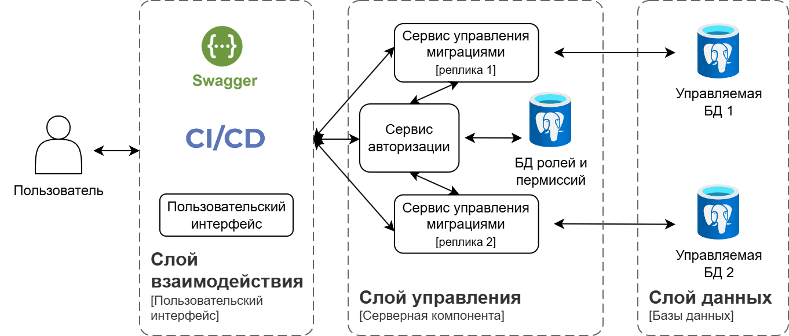

# Серверная компонента приложения для управления миграциями в реляционных базах данных

## Описание

Данный проект представляет собой серверную компоненту для централизованного управления миграциями в реляционных базах данных. Разработанное решение призвано устранить ограничения существующих инструментов, таких как отсутствие готового API для удобной интеграции в CI/CD процессы, минимальные возможности мониторинга и отчетности, а также ограниченная автоматизация.

Целью работы стала разработка гибкого, надежного и масштабируемого решения, встраиваемого в современные рабочие процессы.

## Цели и Задачи

**Цель:** Разработка серверной компоненты приложения для управления миграциями в реляционных базах данных с использованием микросервисной чистой архитектуры.

**Задачи:**

*   Анализ существующих решений.
*   Проектирование архитектуры системы.
*   Разработка программных интерфейсов (REST API, gRPC).
*   Реализация микросервисов управления миграциями и авторизации.
*   Автоматизация генерации документации (Swagger, Godoc).
*   Обеспечение контейнеризации и автоматизации развертывания.

## Архитектура

Система построена на принципах микросервисной архитектуры и следует паттерну Чистой архитектуры (Clean Architecture) для организации внутренней структуры каждого сервиса.

Основные компоненты:

1.  **Слой взаимодействия:** Включает Пользовательский интерфейс, системы CI/CD и Swagger для работы с API. Точки входа для пользователей и автоматизированных процессов. В работе этот слой представлен swagger UI.
2.  **Слой управления:** Разработанная серверная компонента. Состоит из двух ключевых микросервисов:
    *   **Сервис авторизации (Auth Service):** Управляет пользователями, ролями, правами доступа. Предоставляет API для регистрации, аутентификации (выдача JWT), и проверки прав доступа. Использует отдельную базу данных.
    *   **Сервис миграций (Migration Service):** Управляет жизненным циклом миграций целевых баз данных. Предоставляет API для создания, применения, отката, просмотра статуса и истории миграций. Взаимодействует с Auth Service для авторизации операций. Использует целевую БД для хранения метаданных миграций и логов. Может масштабироваться путем запуска нескольких реплик.
3.  **Слой данных:** Целевые реляционные базы данных (например, PostgreSQL), в которых непосредственно выполняются миграции, управляемые Сервисом миграций.

Внутренняя структура микросервисов построена согласно Чистой архитектуре, обеспечивая разделение слоев: доменный слой (бизнес-сущности и правила), слой сценариев использования (логика применения сущностей), и адаптеры (взаимодействие с внешними деталями: БД, сетевые протоколы).

## Стек технологий

*   **Язык программирования:** Go
*   **Базы данных:** PostgreSQL (для сервисов и целевых БД)
*   **Контейнеризация:** Docker, Docker Compose
*   **API:** gRPC, REST, Protocol Buffers
*   **Документация:** Swagger (для REST API), Godoc (для кода)
*   **Архитектурные подходы:** Микросервисы, Чистая архитектура

## Возможности (API)

Проект предоставляет программные интерфейсы для следующих операций:

**Сервис Авторизации:**

*   Регистрация новых пользователей.
*   Аутентификация пользователей и получение JWT токена.
*   Проверка прав доступа по токену.

**Сервис Миграций:**

*   Создание файлов миграций.
*   Применение миграций к целевой базе данных.
*   Откат примененных миграций.
*   Просмотр статуса миграций для конкретной базы данных.
*   Просмотр истории выполненных миграций.

## Документация

Для удобства использования и сопровождения проекта реализована автоматическая генерация документации:

*   **Swagger UI:** Интерактивная документация для REST API.
    
    Запуск Swagger UI происходит через команду `make swagger`.

*   **Godoc:** Актуальная документация по исходному коду Go.

    Запуск Godoc происходит через команду `make godoc`.

## Развертывание

Система спроектирована для развертывания с использованием контейнеров Docker. Автоматизация развертывания осуществляется при помощи Docker Compose, что обеспечивает стандартизированную среду и упрощает запуск всех компонентов.

Запуск системы происходит через команду `make run-all`.

## Результат

В рамках выпускной квалификационной работы была разработана микросервисная система для управления миграциями, обладающая следующими характеристиками:

*   Реализованы REST API и gRPC для широких возможностей интеграции.
*   Внедрены ролевая аутентификация и авторизация на основе JWT для обеспечения безопасности.
*   Поддержка логирования и мониторинга статусов миграций.
*   Использование контейнеров Docker для упрощения развертывания.
*   Автоматическая генерация актуальной документации (Swagger, Godoc).
*   Достигнута гибкость, надежность и масштабируемость решения.

---

*Выпускная квалификационная работа бакалавра студента группы М8О-406Б-21: Чапкина Владислава Вячеславовича, Научный руководитель: В.Н. Лукин.*