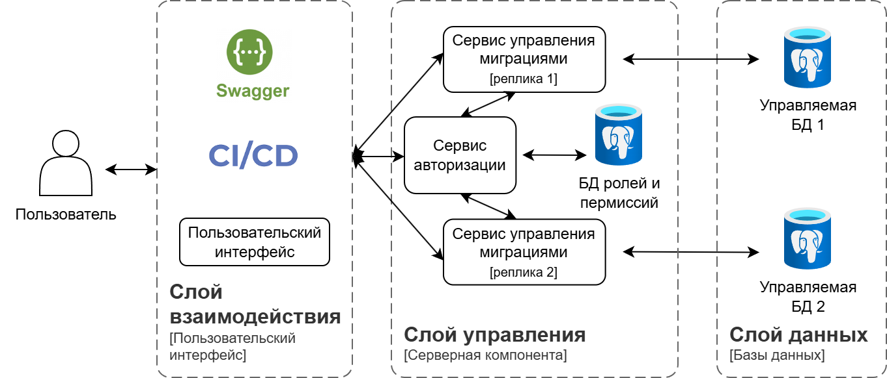
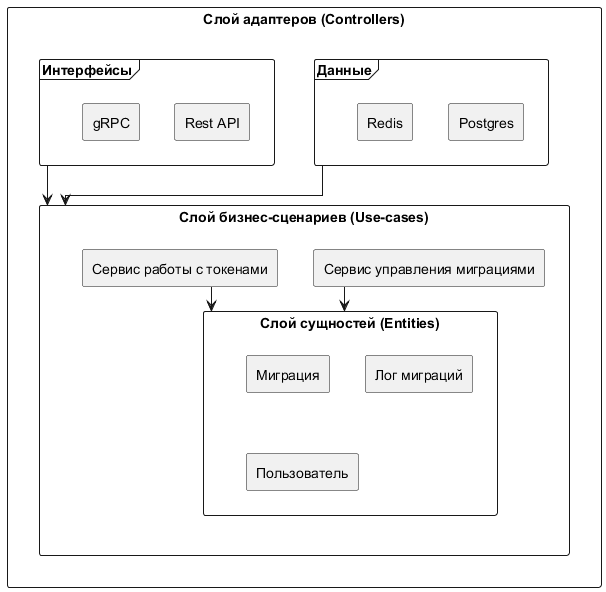
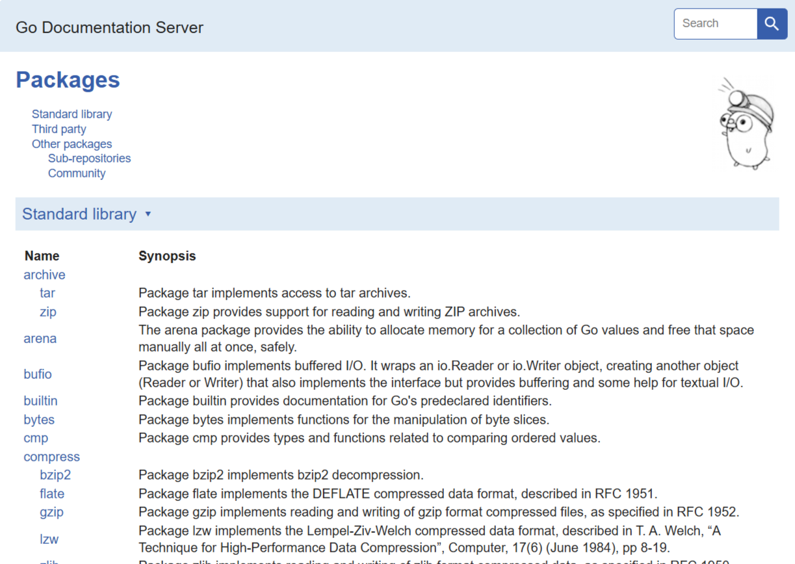
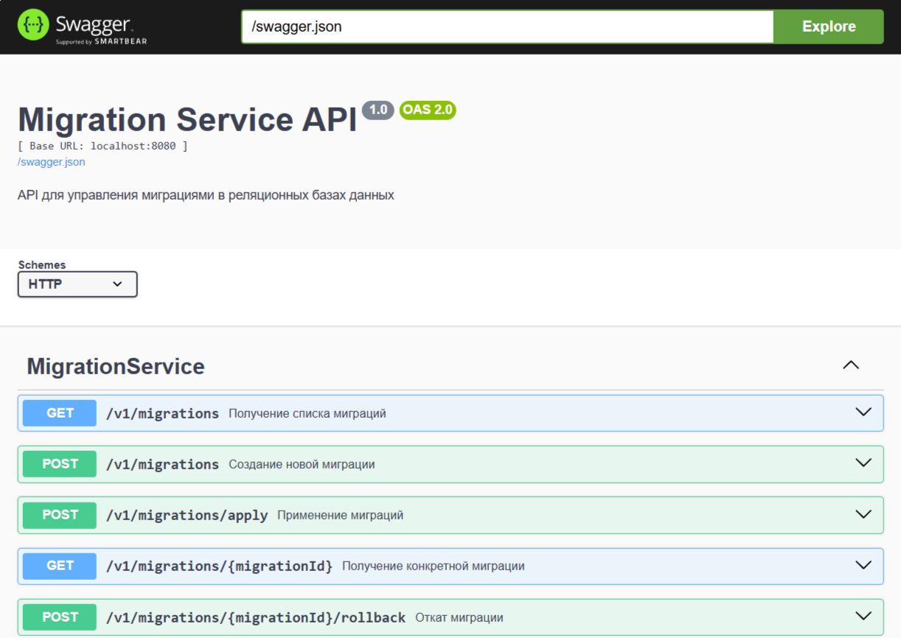

% Выпускная квалификационная работа бакалавра на тему: Серверная компонента приложения для управления миграциями в реляционных базах данных

% Студент группы М8О-406Б-21: Чапкин Владислав Вячеславович Научный руководитель: кандидат физико-математических наук, доцент, доцент 806 кафедры МАИ В.Н. Лукин

## **Актуальность темы**

- Миграции — часть жизненного цикла приложений с БД
- Обеспечивают синхронизацию изменений и консистентность данных
- Существующие инструменты обладают ограничениями:
    - Отсутствие готового API для интеграции
    - Минимальные возможности мониторинга и отчетности
    - Ограниченная автоматизация
- Требуется централизованное решение, встраиваемое в рабочие процессы CI/CD

::: notes
Разработка программного обеспечения, использующего базы данных, неизбежно связана с необходимостью управления изменениями их структуры – то есть миграциями.

Актуальность моей работы обусловлена тем, что существующие инструменты, такие как Migrate и Goose, не предоставляют полноценного API для удобной автоматизации и интеграции в сложные CI/CD конвейеры. Отсутствие готового API, минимальные возможности мониторинга и отчетности создают трудности в крупных проектах. Возникает необходимость в разработке серверной компоненты, которая бы централизовала управление миграциями, предоставила удобный интерфейс для мониторинга и поддержала автоматизацию.
:::

## **Цель и задачи работы**

**Цель** - разработка серверной компоненты приложения для управления миграциями в реляционных базах данных с использованием микросервисной чистой архитектуры.

**Задачи :**

- Анализ существующих решений
- Проектирование архитектуры
- Разработка программных интерфейсов (REST API, gRPC)
- Реализация микросервисов управления миграциями и авторизации
- Автоматизация генерации документации (Swagger, Godoc)
- Обеспечение контейнеризации и автоматизации развертывания

::: notes

Целью работы стала разработка серверной компоненты, которая устранит выявленные недостатки аналогов и предложит современный подход к управлению миграциями.

Для достижения этой цели были поставлены и решены следующие задачи: проведен анализ существующих инструментов, спроектирована архитектура системы с учетом принципов микросервисов и чистой архитектуры, разработаны API для взаимодействия, реализованы ключевые сервисы, автоматизирована документация и настроена контейнеризация для упрощения развертывания.

:::

## **Стек технологий**

:::::: columns
::: column
- Go
- PostgreSQL
- Docker, Docker Compose
- API: gRPC, REST, Protocol Buffers
- Swagger, Godoc
- Микросервисы, Чистая архитектура
:::
::: column

{width=5%}

{width=5%}

{width=5%}

{width=5%}

{width=5%}

{width=5%}

:::
::::::

::: notes

Для реализации проекта был выбран современный стек технологий. Язык Go обеспечивает высокую производительность и простоту разработки параллельных приложений. PostgreSQL как надежная СУБД для хранения данных. Docker и Docker Compose для обеспечения стандартизированной среды и упрощения развертывания. Для взаимодействия выбраны gRPC и REST API с использованием Protocol Buffers для четкой спецификации. Swagger и Godoc для автоматической документации. Архитектурные решения базируются на микросервисах и принципах чистой архитектуры.
:::

## **Архитектура проекта**

::: notes
На этом слайде представлена общая архитектура разработанной системы, которая разделена на три логических слоя: Слой взаимодействия, Слой управления и Слой данных.

Слой взаимодействия включает Пользовательский интерфейс, системы CI/CD и Swagger для работы с API. Это точки входа для пользователей и автоматизированных процессов.

Слой управления представляет собой разработанную серверную компоненту. Он состоит из двух ключевых микросервисов: Сервиса авторизации и Сервиса управления миграциями. Для обеспечения масштабируемости Сервис управления миграциями может запускаться в нескольких репликах. Этот слой также включает базу данных, используемую самими сервисами управления и авторизации.

Слой данных содержит целевые реляционные базы данных (например, PostgreSQL), в которых непосредственно выполняются миграции, управляемые Сервисом миграций.

Стрелки на диаграмме показывают направление взаимодействия: Пользователь или CI/CD система взаимодействует через Слой взаимодействия со Слоем управления, который в свою очередь выполняет операции над Слоем данных, то есть над целевыми базами данных.
:::

## **Чистая архитектура**

Чистая архитектура (Clean Architecture) — это подход к разработке приложений, который обеспечивает четкое разделение слоев и инверсию зависимостей.

::: notes

Внутренняя структура каждого микросервиса построена согласно принципам Чистой архитектуры. Это означает, что зависимости всегда направлены внутрь, к доменному слою, который содержит основные бизнес-сущности и правила. Слой сценариев использования содержит логику, определяющую, как эти сущности применяются. Внешние слои (адаптеры) отвечают за взаимодействие с внешними деталями – базами данных, сетевыми протоколами. Такой подход делает бизнес-логику независимой от инфраструктурных деталей, что существенно упрощает тестирование, внесение изменений и масштабирование.

:::

## **Описание компонентов**

**Сервис авторизации (Auth Service)**

- Управляет пользователями, ролями, правами
- Предоставляет API для:
    - Регистрации/Аутентификации
    - Получение JWT токена
    - Проверки прав доступа по токену
- Использует отдельную БД для хранения данных пользователей и прав

::: notes
Сервис авторизации - это отдельный микросервис, отвечающий за управление аутентификацией и авторизацией. Он хранит информацию о пользователях, ролях и правах в своей собственной базе данных и предоставляет стандартные API для входа, выхода и, проверки наличия прав у пользователя. Этот сервис обеспечивает безопасность всех операций в системе.
:::

## **Описание компонентов**

**Сервис миграций (Migration Service)**

- Управляет жизненным циклом миграций БД
- Предоставляет API для:
    - Создания миграций
    - Применения миграций
    - Отката миграций
    - Просмотра статуса и истории миграций
- Использует целевую БД для хранения метаданных миграций и логов
- Взаимодействует с Auth Service для авторизации операций

::: notes
Сервис миграций яотвечает за все операции, связанные с изменениями схемы базы данных. Этот сервис работает напрямую с целевой базой данных где происходит выполнение SQL-скриптов миграций. Перед выполнением любой операции, требующей специальных прав, сервис миграций обращается к Сервису авторизации для их проверки.

:::

## **Автоматическая генерация документации**

:::::: columns
::: column
### **Код**

:::
::: column
### **Интерфейсы**

:::
::::::

::: notes
Значительное внимание уделено автоматической генерации документации. Swagger UI предоставляет интерактивную документацию для REST API, а Godoc – актуальную документацию самого кода. Это повышает прозрачность проекта и удобство его использования и сопровождения.
:::

## **Результат**

- Разработана микросервисная система для управления миграциями
- Реализованы REST API и gRPC для взаимодействия и интеграции
- Внедрены аутентификация и авторизация на основе ролей и JWT
- Для удобства развертывания используются контейнеры 
- Обеспечена автоматическая генерация актуальной документации 
- Достигнута гибкость, надежность и масштабируемость

::: notes
В результате выполнения выпускной квалификационной работы была разработана полноценная микросервисная система для управления миграциями в реляционных базах данных.
Были реализованы гибкие интерфейсы в двух форматах - REST и gRPC, что обеспечивает широкие возможности для интеграции. Внедрена система аутентификации и авторизации на основе ролей, гарантирующая безопасность операций. Обеспечено логирование и возможность мониторинга статусов миграций через API.
Автоматизирована документация и использована контейнеризации для развертывания.
Разработанное решение обладает модульной структурой и масштабируемостью, что делает его пригодным для использования в реальных проектах и соответствует  требованиям к процессам разработки и эксплуатации.
:::

## **Источники**

- Martin R. C. Чистая архитектура: Руководство мастера по структуре и дизайну программного обеспечения. — Prentice Hall, 2017.
- Kleppmann M. Проектирование приложений, интенсивно работающих с дан-ными: Основные идеи надежных, масштабируемых и обслуживаемых систем. — O’Reilly Media, 2017.
- Ambler S. W., Sadalage P. J. Рефакторинг баз данных: Эволюционный дизайн баз данных. — Addison-Wesley, 2012.

::: notes
Список использованных источников представлен в соответствующем разделе выпускной квалификационной работы.

Благодарю за внимание! Готов ответить на ваши вопросы.
:::