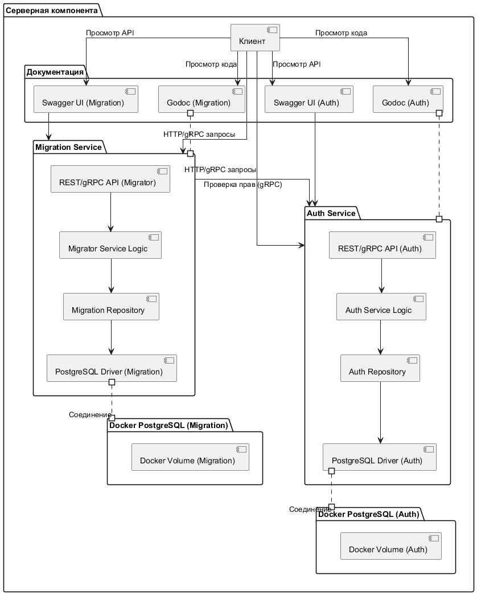
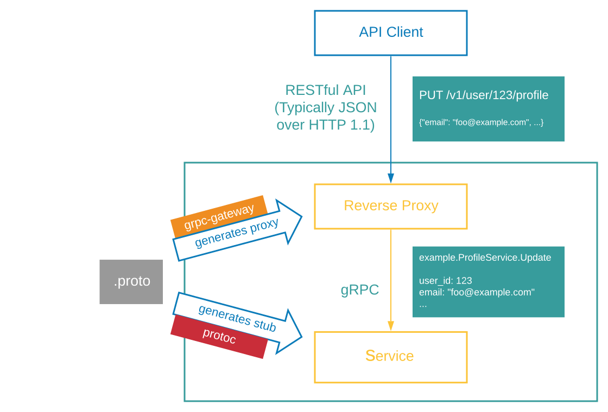

# [Заключение]{custom-style="UnnumberedHeadingOne"} {.unnumbered}

В рамках выполнения выпускной квалификационной работы разработана серверная компонента для управления миграциями в реляционных базах данных, которая обеспечивает автоматизированное, безопасное и масштабируемое решение для синхронизации изменений схемы базы данных в различных окружениях. Разработанная компонента ориентирована на поддержку процессов непрерывной интеграции и доставки (CI/CD), предоставляя инструментарий для создания, применения, отката и мониторинга миграций, что делает ее востребованной в современных условиях разработки программного обеспечения.

Приложение реализовано на основе микросервисной архитектуры с применением принципов чистой архитектуры, что обеспечило модульность, слабую связанность компонентов и высокую степень масштабируемости. Использование контейнеризации на базе Docker и Docker Compose позволило стандартизировать среду выполнения, упростить развертывание и обеспечить воспроизводимость системы в различных окружениях. Разработанные сервисы, включая сервис управления миграциями и сервис авторизации, взаимодействуют через четко определенные REST и gRPC API, что гарантирует их интеграцию в сложные инфраструктуры и упрощает взаимодействие с внешними системами.

В процессе разработки были реализованы все запланированные функциональные и нефункциональные требования. Система поддерживает работу с реляционной базой данных PostgreSQL, обеспечивает аутентификацию и авторизацию на основе JWT, предоставляет механизмы логирования и мониторинга операций. Особое внимание уделено автоматизации документирования: использование Swagger и Godoc позволило создать актуальную и доступную документацию API и кода, что упрощает сопровождение и дальнейшее развитие проекта.

Применение подхода API First, основанного на Protocol Buffers, обеспечило четкость и предсказуемость интерфейсов, автоматизацию генерации кода и документации. Реализация механизма передачи транзакций через контекст позволила централизовать управление транзакциями на уровне бизнес-логики, обеспечивая атомарность операций и повышая надежность системы. Структура кодовой базы, спроектированая по принципам чистой архитектуры, гарантирует легкость тестирования, замены компонентов и расширения функциональности.

Разработанное решение обладает потенциалом для дальнейшего развития. Благодаря модульной архитектуре и использованию современных технологий, таких как Go, PostgreSQL и Docker, система может быть легко адаптирована для поддержки дополнительных СУБД, интеграции с другими сервисами или расширения функциональности, например, добавления аналитических инструментов или поддержки сложных сценариев миграций. Таким образом, разработанное приложение представляет собой надежное, гибкое и масштабируемое решение, соответствующее современным требованиям к управлению миграциями в реляционных базах данных.

# [Список использованных источников]{custom-style="UnnumberedHeadingOne"} {.unnumbered}

# [ПРИЛОЖЕНИЕ\ А]{custom-style="AppendixHeadingOne"} {#sec:app-a label="A"}

## [Архитектура серверной компоненты приложения]{custom-style="UnnumberedHeadingTwo"} {.unnumbered}

{#fig:all-arc width=14cм}

# [ПРИЛОЖЕНИЕ\ Б]{custom-style="AppendixHeadingOne"} {#sec:app-b label="B"}

## [Диаграмма работы API для управления миграциями]{custom-style="UnnumberedHeadingTwo"} {.unnumbered}

{#fig:migrator-api width=14cм}