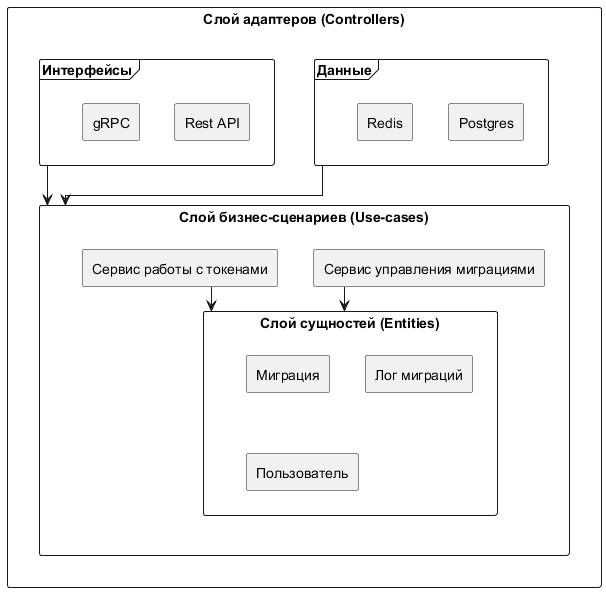

---
csl: gost-r-7-0-5-2008-numeric-iaa.csl
bibliography: links.bib
...

# АНАЛИЗ СУЩЕСТВУЮЩИХ РЕШЕНИЙ
## Понятие миграций в реляционных базах данных

Миграции в реляционных базах данных -- управляемый
процесс изменения структуры базы данных . Процесс включает создание,
модификацию или удаление таблиц, индексов, связей и других элементов
схемы базы данных. При использовании миграции разработчики
синхронизируют изменения между различными средами разработки, 
тестирования и продуктовой средой, обеспечивая консистентность данных
и облегчая процесс развертывания обновлений [@Date2003;@Codd1970].

Основные задачи миграций:

- обновление схемы базы данных с добавлением новых таблиц и полей,

- модификация существующих структур данных (переименование, изменение типа данных и т.д.),

- откат изменений для возврата базы данных к предыдущему состоянию,

- отслеживание истории изменений и их последовательности.

Процесс миграций особенно актуален для систем с непрерывной
интеграцией и доставкой (CI/CD), где изменения в базе данных должны
автоматически синхронизироваться с кодом приложения. Без надлежащего
управления миграциями возникает риск несоответствия структуры базы
данных и логики приложения, что может привести к сбоям в работе системы [@KimBehrSpafford2013].

## Анализ популярных инструментов для управления миграциями

В настоящее время существует ряд инструментов и библиотек, которые
помогают управлять миграциями в реляционных базах данных. Рассмотрим два
наиболее популярных решения: Migrate и Goose.

Migrate -- открытая библиотека для управления миграциями, написанная
на Go. Она предоставляет базовый функционал для создания, применения и
отката миграций [@MigrateDoc].

Преимущества:

- поддержка нескольких баз данных: PostgreSQL, MySQL, SQLite, SQL Server и другие,

- гибкость хранения миграций: файлы миграций могут находиться в файловой системе или в облачных хранилищах (S3, GCS),

- инструмент командной строки: Migrate предоставляет CLI для выполнения миграций вне основного кода приложения.

Недостатки:

- ограниченный функционал: библиотека ориентирована на минимальные операции с миграциями (применение, откат) и не предоставляет дополнительных возможностей для мониторинга и управления,

- отсутствие готового API: Migrate не предлагает API для автоматизированного управления миграциями,

- минимальная отчетность: система не предоставляет встроенных механизмов для отслеживания статуса и логирования миграций.


Goose -- еще один инструмент для управления миграциями на языке Go. Его
основное преимущество -- поддержка как SQL-скриптов, так и программного
кода на Go для выполнения миграций [@GooseDoc].

Преимущества:

- гибкость в написании миграций: поддержка миграций на чистом SQL и в виде кода на Go,

- командная строка: Goose имеет CLI для удобного управления миграциями вручную,

- широкая поддержка баз данных: PostgreSQL, MySQL, SQLite и другие СУБД,

- легкость интеграции: Goose легко встраивается в существующие проекты на Go.

Недостатки:

- ограниченная автоматизация: отсутствие готового REST API ограничивает возможности интеграции с другими сервисами,

- слабый мониторинг: Goose не предоставляет встроенных инструментов для отслеживания состояния миграций или ведения отчетности,

- ограниченная поддержка сложных сценариев: инструмент не рассчитан на сложные схемы управления миграциями с аналитикой и отчетами.

## Проблемы существующих инструментов 

На основе анализа инструментов Migrate и Goose выявлены следующие
проблемы и ограничения существующих решений для управления миграциями:

Отсутствие централизованного API: большинство инструментов не
предоставляют REST или gRPC API для удаленного управления миграциями,
что усложняет интеграцию с другими системами, требующих гибкого
управления через API [@Medjaoui2018].

Минимальные возможности мониторинга: существующие решения не позволяют
отслеживать состояние миграций в реальном времени или получать подробные
отчеты по истории изменений.

Ограниченная автоматизация: большинство инструментов рассчитаны на
ручное управление миграциями с использованием командной строки и не
поддерживают автоматическое управление в крупных системах.

Логирование и отчетность: недостаток встроенных инструментов для
логирования операций и ведения истории миграций.

Эти проблемы особенно актуальны для крупных проектов, где изменения в
базах данных происходят регулярно, а управление миграциями должно быть
прозрачным и автоматизированным.

## Требований к разрабатываемому приложению

На основании анализа существующих решений и выявленных проблем
сформулированы ключевые требования к разрабатываемому приложению.

Функциональные требования:

- возможность создавать, применять и откатывать миграции в реляционных базах данных,

- предоставление информации о статусе миграций (выполненные, откатанные, ожидающие выполнения),

- поддержка СУБД PostgreSQL,

- хранение истории миграций для их анализа и аудита.

API и взаимодействие:

- разработка REST API для автоматизированного управления миграциями,

- поддержка основных методов: запуск миграций, откат миграций, просмотр статуса,

- формат запросов и ответов -- JSON.

Требования к безопасности:

- внедрение аутентификации и авторизации (например, JWT),

- ограничение доступа к данным миграций на основе ролей и политик безопасности.

Производительность и отказоустойчивость:

- поддержка работы приложения под высокой нагрузкой,

- возможность горизонтального масштабирования сервиса.

Дополнительные возможности:

- интеграция с инструментами контейнеризации (Docker),

- логирование всех операций,

- документация API с использованием Swagger.

Таким образом, был проведен анализ существующих решений для управления
миграциями, выявлены их ограничения и сформулированы требования к
разрабатываемому приложению. Полученные выводы использованы для
проектирования и реализации серверной компоненты, которая устраняет
недостатки аналогов и предоставляет инструмент для
управления миграциями в реляционных базах данных.

# ВЫБОР АРХИТЕКТУРЫ И ПРОЕКТИРОВАНИЕ СИСТЕМЫ

## Обоснование выбора архитектуры

Для реализации серверной компоненты приложения для управления миграциями
в реляционных базах данных было выбрано микросервисное архитектурное
решение с применением принципов чистой архитектуры (Clean
Architecture). Описанный подход разделяет приложение на
независимые слои, минимизируя зависимость между компонентами и
обеспечивая легкость сопровождения и масштабирования системы [@Martin2017].

Преимущества микросервисной архитектуры:

Модульность и независимость компонентов -- каждый сервис разрабатывается
и поддерживается независимо, что упрощает внесение изменений и
добавление нового функционала.

Масштабируемость -- микросервисы могут быть масштабированы отдельно в
зависимости от нагрузки на каждый из них.

Устойчивость к сбоям -- сбой одного компонента не приводит к отказу всей
системы.

Гибкость -- возможность замены или обновления отдельных компонентов без
влияния на остальные части системы.

Принципы чистой архитектуры:

Четкое разделение приложения на слои: внешний слой интерфейсов, слой
сервисов и бизнес-логики.

Независимость бизнес-логики от внешних компонентов: баз данных,
интерфейсов и фреймворков.

Простота тестирования и изоляции: каждый слой тестируется отдельно, что
повышает надежность системы.

## Общая архитектура микросервисов

Архитектура каждого микросервиса строится согласно принципам Чистой архитектуры,
где зависимости всегда направлены внутрь, к центру. Подход обеспечивает изоляцию 
бизнес-логики от внешних деталей, таких как базы данных, UI или внешние сервисы [@Newman2019]. 
Каждый микросервис состоит из следующих основных слоев, расположенных концентрически,
пример на риунке [-@fig:clean-arc].

{#fig:clean-arc width=14cm}

Внешний слой:

- слой находится на периферии и содержит все внешние взаимодействия,
- включает в себя Интерфейсы, такие как REST API и gRPC, для обработки входящих запросов,
- включает Данные -- адаптеры для работы с внешними  хранилищами данных, такими как PostgreSQL и Redis,
- компоненты слоя зависят от слоя бизнес-сценариев.

Слой приложения:

- расположен внутри внешнего слоя и содержит бизнес-логику, специфичную для конкретного микросервиса,
- здесь определяются и реализуются основные сценарии использования (use cases), такие как запуск миграций, откат миграций, получение статуса миграций, логика аутентификации и авторизации в соответствующих сервисах,
- слой управляет потоком данных, координируя действия между внешним слоем и доменным слоем,
- компоненты слоя зависят от доменного слоя.

Доменный слой:

- ядро архитектуры, находится в самом центре,
- содержит основные бизнес-сущности (например, Миграция, Лог миграции, Пользователь) и основные правила предметной области,
- слой полностью независим от всех внешних слоев (адаптеров, сценариев использования) и не содержит зависимостей от инфраструктурных деталей или внешних сервисов, что делает его наиболее стабильной частью системы.

Таким образом, зависимости всегда направлены от внешнего слоя ко внутреннему:
Адаптеры, Сценарии использования, Сущности.

## Проектирование архитектуры межсервисного взаимодействия

В соответствии с выбранной микросервисной архитектурой, система включает 
два ключевых сервиса:

1.  Сервис авторизации (Auth Service): 

Отвечает за управление пользователями, их ролями и правами доступа. 
Предоставляет API для аутентификации, авторизации и управления учетными записями.

2.  Сервис управления миграциями (Migration Service):

Отвечает за управление миграциями базы данных, ведение истории миграций, 
логирование и сбор метрик.  Предоставляет API для применения, отката и 
просмотра статуса миграций.

Взаимодействие между сервисами и пользователями происходит следующим образом (см.
рисунок [-@fig:user-services]):

1.  Пользователь вводит учетные данные в клиентском приложении.
2.  Клиентское приложение отправляет запрос на авторизацию в Auth Service.
3.  Auth Service проверяет учетные данные в БД авторизации.
4.  Auth Service возвращает JWT токен клиентскому приложению в случае успешной 
    аутентификации.
5.  Пользователь отправляет запрос на операцию с миграцией через клиентское 
    приложение, прикладывая JWT токен.
6.  Клиентское приложение пересылает запрос в Migration Service, передавая JWT токен.
7.  Migration Service обращается к Auth Service для проверки прав доступа
    пользователя, используя JWT токен.
8.  Auth Service возвращает информацию о правах доступа.
9.  Если у пользователя достаточно прав, Migration Service выполняет операцию
    с миграцией в БД миграций и возвращает результат клиентскому приложению. 
    В противном случае, возвращается ошибка о недостаточных правах.
10. Клиентское приложение отображает результат пользователю.

Для обеспечения безопасности, Migration Service требует наличия JWT токена в 
каждом запросе. Взаимодействие между сервисами происходит посредством gRPC, что обеспечивает высокую производительность и поддержку строгой типизации благодаря использованию Protocol Buffers [@gRPCDoc].
Пользователи могут взаимодействовать с сервисами через HTTP REST API или gRPC.
Архитектура предусматривает валидацию входящих данных и детальное логирование всех запросов.

{#fig:user-services width=14cm}

Диаграмма взаимодействия сервисов (рисунок [-@fig:user-services]) иллюстрирует последовательность
вызовов между компонентами системы.  Предложенная архитектура обеспечивает четкое
разделение ответственности, независимое масштабирование и устойчивость к сбоям,
что очень важно для развития и поддержки проекта [@Kleppmann2017].

## Проектирование структуры базы данных

Проектирование структуры базы данных -- критически важный этап при
разработке микросервисов, особенно когда требуется гибкое управление
пользователями, ролями, правами доступа и историей выполнения операций [@Ambler2012;@Zhang2017].
Для создания микросервисов авторизации и управления миграциями базы данных,
обеспечивающих контроль доступа на основе ролей, была разработана следующая
структура баз данных, разделенных между сервисами:

### База данных сервиса авторизации (Auth Service)

База данных сервиса авторизации предназначена для хранения информации о
пользователях, их ролях и ассоциированных с ролями правах доступа. Структура
включает следующие таблицы:

1.  Таблица [-@tbl:table-users] `users`

    Описание: хранит основную информацию о пользователях системы.

    --------------- ---------------- ----------------------------------------
    Поле            Тип данных       Описание
    --------------- ---------------- ----------------------------------------
    id              BIGINT (PK)      Уникальный идентификатор пользователя.

    login           TEXT             Логин пользователя.

    password_hash   TEXT             Хэш пароля пользователя.

    created_at      TIMESTAMP        Дата и время создания записи.

    updated_at      TIMESTAMP        Дата и время последнего обновления записи.
    --------------- ---------------- ----------------------------------------

    Table: Описание полей таблицы `users` {#tbl:table-users}

2.  Таблица [-@tbl:table-roles] `roles`

    Описание: хранит перечень ролей, доступных в системе.

    ------------- --------------- ---------------------------------------------
    Поле          Тип данных      Описание
    ------------- --------------- ---------------------------------------------
    id            BIGINT (PK)     Уникальный идентификатор роли.

    name          TEXT            Название роли (например, "admin",
                                  "developer", "viewer").

    description   TEXT            Описание роли.
    ------------- --------------- ---------------------------------------------

    Table: Описание полей таблицы `roles` {#tbl:table-roles}

3.  Таблица [-@tbl:table-permissions] `permissions`

    Описание: хранит перечень прав доступа, которые могут быть назначены ролям.

    ------------- --------------- ---------------------------------------------
    Поле          Тип данных      Описание
    ------------- --------------- ---------------------------------------------
    id            BIGINT (PK)     Уникальный идентификатор права.

    name          TEXT            Название права (например, "apply_migration", 
                                  "rollback_migration").

    description   TEXT            Описание права.
    ------------- --------------- ---------------------------------------------

    Table: Описание полей таблицы `permissions` {#tbl:table-permissions}

4.  Таблица [-@tbl:table-role_permissions] `role_permissions`

    Описание: таблица связей, определяющая, какие права доступа назначены
    определенной роли (отношение "многие ко многим" между ролями и правами).

    --------------- ------------ ---------------------------------------------
    Поле            Тип данных   Описание
    --------------- ------------ ---------------------------------------------
    role_id         BIGINT (FK)  Идентификатор роли (ссылается на roles.id).

    permission_id   BIGINT (FK)  Идентификатор права (ссылается на
                                 permissions.id).
    --------------- ------------ ---------------------------------------------

    Table: Описание полей таблицы `role_permissions` {#tbl:table-role_permissions}

5.  Таблица [-@tbl:table-user_roles] `user_roles`

    Описание: таблица связей, определяющая, какие роли назначены определенному
    пользователю (отношение "многие ко многим" между пользователями и ролями).

    --------- ------------- -------------------------------------------------
    Поле      Тип данных    Описание
    --------- ------------- -------------------------------------------------
    user_id   BIGINT (FK)   Идентификатор пользователя (ссылается на users.id).

    role_id   BIGINT (FK)   Идентификатор роли (ссылается на roles.id).
    --------- ------------- -------------------------------------------------

    Table: Описание полей таблицы `user_roles` {#tbl:table-user_roles}

Связи между таблицами в базе данных сервиса авторизации представлены 
на рисунке [-@fig:tables-auth].

{#fig:tables-auth width=14cm}

Основные связи:

- пользователи и роли связаны через таблицу `user_roles` (отношение многие ко многим),
- роли и права доступа связаны через таблицу `role_permissions` (отношение многие ко многим).

### База данных сервиса миграций (Migration Service)

База данных сервиса миграций предназначена для хранения информации о
доступных миграциях, их статусе выполнения и истории изменений. Структура
включает следующие таблицы:

1.  Таблица [-@tbl:table-migrations] `migrations`

    Описание: хранит метаданные о каждой миграции.

    ----------------- ---------------- ----------------------------------------
    Поле              Тип данных       Описание
    ----------------- ---------------- ----------------------------------------
    id                BIGINT (PK)      Уникальный идентификатор миграции.
 
    name              TEXT             Название миграции (например,
                                       "create_users_table").
 
    description       TEXT             Краткое описание миграции.
 
    script            TEXT             SQL скрипт миграции (или путь к нему).

    rollback_script   TEXT             SQL скрипт отката миграции (или путь к нему).
 
    status            ENUM('pending',  Текущий статус выполнения миграции 
                      'applied',       ('ожидает', 'применена', 'откачена').
                      'rolled_back') 
 
    created_by        BIGINT (FK)      Идентификатор пользователя (из Auth
                                       Service), создавшего миграцию.
 
    created_at        TIMESTAMP        Дата и время создания миграции.
 
    status_updated_at TIMESTAMP        Дата и время последнего обновления статуса.
    ----------------- ---------------- ---------------------------------------

    Table: Описание полей таблицы `migrations` {#tbl:table-migrations}

2.  Таблица [-@tbl:table-migration_logs] `migration_logs`

    Описание: хранит историю всех операций применения и отката миграций.

    --------------- ----------------- ----------------------------------------
    Поле            Тип данных        Описание
    --------------- ----------------- ----------------------------------------
    id              BIGINT (PK)       Уникальный идентификатор записи лога.

    migration_id    BIGINT (FK)       Идентификатор миграции (ссылается на migrations.id).

    action          ENUM('apply',     Тип действия: применение ('apply') или 
                    'rollback')       откат ('rollback') миграции.

    executed_by     BIGINT (FK)       Идентификатор пользователя (из Auth
                                       Service), выполнившего действие.

    executed_at     TIMESTAMP         Дата и время выполнения действия.

    success         BOOLEAN           Результат выполнения действия (true - 
                                      успешно, false - неуспешно).

    error_message   TEXT              Сообщение об ошибке (при наличии).
    --------------- ----------------- ----------------------------------------

    Table: Описание полей таблицы `migration_logs` {#tbl:table-migration_logs}

Связи между таблицами в базе данных сервиса миграций представлены на
рисунке [-@fig:tables-migrator].

{#fig:tables-migrator width=10cm}

Основные связи:

- таблица `migrations` имеет неявный внешний ключ (`created_by`), условно ссылающийся на таблицу `users` в базе данных Auth Service, что позволяет отслеживать, кто создал миграцию,
- таблица `migration_logs` связана с таблицей `migrations` (отношение один ко многим: одна миграция может иметь много записей в логе) и аналогично ссылается на таблицу `users` в базе данных Auth Service через поле `executed_by`.

Предложенная структура баз данных обеспечивает необходимое разделение данных
между микросервисами, гибкое управление пользователями и их правами и 
детальное логирование операций с миграциями, что соответствует требованиям
построения масштабируемого и безопасного решения.

## Проектирование интерфейса взаимодействия (API)

Эффективность и удобство использования программной системы во многом определяются
качеством ее программного интерфейса (API). В контексте распределенной архитектуры,
состоящей из микросервисов, четко определенный API -- критически важен для
обеспечения взаимодействия между компонентами и предоставления 
стандартизированного доступ к функциональности системы внешним потребителям.

Проектирование API включает определение доступных конечных точек (endpoints),
используемых методов HTTP, структур данных для запросов и ответов,
механизмов аутентификации и авторизации.

Для разработанной системы был спроектирован REST API, который служит основным
интерфейсом взаимодействия с серверной частью. Документация API, генерируемая
автоматически в стандартном формате спецификации API (например, OpenAPI),
обеспечивает актуальное и детальное описание всех доступных конечных точек, их
параметров и форматов данных, что значительно упрощает процесс интеграции и
использования, соответствуя принципам спецификации OpenAPI [@OpenAPIDoc].

Система предоставляет следующие ключевые программные интерфейсы для взаимодействия с приложением:

### Интерфейс сервиса авторизации (Auth Service)

Сервис авторизации отвечает за управление жизненным циклом пользователей, включая
регистрацию, аутентификацию и управление сессиями, проверку прав доступа.

Регистрация пользователя:
  - Метод: `POST`;
  - Путь: `/v1/register`;
  - Назначение: создание новой учетной записи пользователя в системе;
  - Структура запроса (`RegisterRequest`):
      - `login` (string): логин пользователя,
      - `password` (string): пароль пользователя.
  - Структура ответа (`RegisterResponse`):
      - `userId` (int64): идентификатор пользователя.

Аутентификация пользователя (Вход в систему):
  - Метод: `POST`;
  - Путь: `/v1/login`;
  - Назначение: проверка предоставленных учетных данных пользователя и выдача аутентификационного токена для последующих запросов;
  - Структура запроса (`LoginRequest`):
      - `login` (string): логин пользователя,
      - `password` (string): пароль пользователя.
  - Структура ответа (`LoginResponse`):
      - `token` (string): аутентификационный токен.

Выход из системы
  - Метод: `POST`;
  - Путь: `/v1/logout`;
  - Назначение: завершение текущей пользовательской сессии путем аннулирования аутентификационного токена;
  - Структура запроса (`LogoutRequest`):
      - `token` (string): аутентификационный токен пользователя.
  - Структура ответа (`LogoutResponse`):
      - `success` (boolean): результат выполнения операции.

Проверка прав доступа:
  - Метод: `POST`;
  - Путь: `/v1/users/{user_id}/check-permission`;
  - Назначение: верификация наличия у пользователя определенного права 
  (`Permission`), необходимого для выполнения той или иной операции;
  - Параметры пути:
      - `user_id` (int64): идентификатор пользователя.
  - Структура запроса (`CheckPermissionRequest`):
      - `token` (string): аутентификационный токен пользователя,
      - `permission` (string): название проверяемого права.
  - Структура ответа (`CheckPermissionResponse`):
      - `has_permission` (boolean): флаг наличия права.

### Интерфейс сервиса миграций (Migration Service)

Сервис миграций предназначен для структурированного управления изменениями схемы
базы данных с помощью миграций. API сервиса миграций предоставляет набор операций
для работы с миграциями.

Создание миграции:
  - Метод: `POST`;
  - Путь: `/v1/migrations`;
  - Назначение: регистрация новой миграции в системе управления миграциями;
  - Структура запроса (`CreateMigrationRequest`):
      - `name` (string): название миграции,
      - `description` (string): описание миграции,
      - `script` (string): текст скрипта для применения миграции,
      - `rollbackScript` (string): текст скрипта для отката миграции,
      - `userId` (int64): идентификатор пользователя, создавшего миграцию.
  - Структура ответа (`CreateMigrationResponse`):
      - `id` (int64): уникальный идентификатор созданной миграции.

Получение списка миграций
  - Метод: `GET`;
  - Путь: `/v1/migrations`;
  - Назначение: предоставление перечня всех зарегистрированных в системе миграций;
  - Параметры запроса (Query Parameters):
      - `status` (string, optional): фильтрация по статусу миграции
      (например, "pending", "applied", "rolled_back").
  - Структура ответа (`ListMigrationsResponse`):
      - `migrations` (array of `MigrationInfo`): список объектов, содержащих
      информацию о миграциях.
  - Структура объекта `MigrationInfo`:
      - `id` (int64): уникальный идентификатор миграции,
      - `name` (string): название миграции,
      - `description` (string): описание миграции,
      - `script` (string): текст скрипта применения,
      - `rollbackScript` (string): текст скрипта отката,
      - `status` (string): текущий статус миграции,
      - `createdBy` (int64): идентификатор пользователя, применившего миграцию,
      - `statusUpdatedAt` (string): дата и время обновления статуса.

Применение миграций
  - Метод: `POST`;
  - Путь: `/v1/migrations/apply`;
  - Назначение: инициирование процесса выполнения одного или нескольких скриптов миграции для обновления схемы базы данных;
  - Структура запроса (`ApplyMigrationsRequest`):
      - `migrationIds` (array of int64): список идентификаторов миграций для применения,
      - `appliedBy` (int64): идентификатор пользователя, выполняющего операцию.
  - Структура ответа (`ApplyMigrationsResponse`):
      - `appliedAt` (string): дата и время завершения операции применения.

Откат миграции
  - Метод: `POST`;
  - Путь: `/v1/migrations/{migration_id}/rollback`;
  - Назначение: отмена изменений, внесенных конкретной миграцией, путем выполнения ее скрипта отката;
  - Параметры пути:
      - `migration_id` (int64): идентификатор миграции, подлежащей откату.
  - Структура запроса (`RollbackMigrationRequest`):
      - `rolledBackBy` (int64): идентификатор пользователя, инициировавшего откат.
  - Структура ответа (`RollbackMigrationResponse`):
      - `rolledBackAt` (string): дата и время завершения операции отката.

Получение деталей миграции
  - Метод: `GET`;
  - Путь: `/v1/migrations/{migration_id}`;
  - Назначение: предоставление подробной информации об определенной миграции по ее уникальному идентификатору;
  - Параметры пути (Path Parameters):
      - `migration_id` (int64): идентификатор миграции.
  - Структура ответа (`GetMigrationResponse`): 
      - Содержит объект типа `migrationMigrationInfo`, аналогичный
      используемому в списке миграций.

### Общие принципы проектирования API

При проектировании API были заложены следующие принципы:

- Стандартизация формата данных: использование формата JSON для обмена данными 
-- общепринятый подходом для RESTful API [@Fielding2000].
- Механизм аутентификации: применение токен-основанной аутентификации для
безопасного доступа к защищенным ресурсам.
- Документация: автоматическая генерация детальной спецификации API для
обеспечения полной информации для разработчиков, использующих API.
- Обработка ошибок: использование стандартных кодов состояния HTTP для индикации
результатов выполнения запросов, включая ошибки, что позволяет клиентам API
корректно обрабатывать исключительные ситуации.
- Разделение ответственности: API каждого сервиса четко определяет границы
его функциональности, соответствуя принципам микросервисной архитектуры.

Такой подход к проектированию API обеспечивает его предсказуемость,
масштабируемость и удобство использовани -- фундамент для
построения надежной и расширяемой системы.

## Используемые инструменты и технологии

Для реализации серверной компоненты системы был выбран следующий набор
технологий и инструментов:

- язык программирования: Golang

    Обеспечивает высокую производительность и эффективность при разработке
    серверных приложений, способствует созданию легко поддерживаемого кода.

- база данных: PostgreSQL

    Надежная реляционная система управления базами данных (СУБД) с широким
    набором функций, поддержкой стандарта SQL и ACID-транзакций, что критически
    важно для обеспечения целостности данных миграций [@PostgreSQLDoc].

- контейнеризация: Docker и Docker Compose

    Позволяют стандартизировать окружение для разработки и развертывания,
    обеспечивая изоляцию компонентов и упрощая управление зависимостями [@DockerDoc].

- документация интерфейса: Swagger

    Автоматизирует процесс генерации и поддержки актуальной документации для
    REST API, улучшая взаимодействие между разработчиками клиентской и
    серверной частей.

- тестирование: Testify и Mockgen

    Testify предоставляет набор удобных инструментов для написания unit-тестов
    в Golang, а Mockgen используется для автоматической генерации моков, что
    упрощает тестирование изолированных компонентов.

- логирование: Zerolog

    Эффективная библиотека для структурированного логирования, позволяющая
    легко собирать и анализировать логи работы приложения.

- контроль версий: Git и GitHub

    Стандартные инструменты для управления исходным кодом, совместной разработки и отслеживания изменений.

Подводим итог главы:

В данной главе был обоснован выбор микросервисной архитектуры
и принципов чистой архитектуры как фундамента для проектирования серверной
части системы. Были детально проработаны аспекты взаимодействия сервисов и
пользовательские сценарии. Спроектирована структура базы данных,
предназначенная для надежного хранения информации о миграциях. Определены
ключевые конечные точки API для обеспечения взаимодействия с приложением.
Выбранный технологический стек обеспечивает необходимую производительность,
надежность и гибкость системы.

Результатом проектирования и четкой структуризации системы стало создание
эффективного, гибкого и масштабируемого приложения, предназначенного для
управления миграциями в реляционных базах данных.

# РЕАЛИЗАЦИЯ ПРИЛОЖЕНИЯ

## Техническая реализация и структура микросервисов

В данном разделе подробно описывается техническая архитектура и реализация ключевых компонентов системы микросервисов. Для иллюстрации выбран сервис управления миграциями (Migration Service), как пример, демонстрирующий основные принципы организации кода, взаимодействия слоев и применения архитектурных паттернов. На рисунке [-@fig:migrator-structure-small] показаны архитектурные компоненты и их взаимодействие с другими компонентами.

{#fig:migrator-structure-small width=13cm}

Архитектура сервиса основывается на принципах Чистой архитектуры (Clean Architecture), адаптированных под специфику разработки на языке Go, с акцентом на разделение ответственности и инверсию зависимостей [@GoCleanArch]. Цель раздела — показать, как применяются выбранные подходы, и как компоненты взаимодействуют между собой.

### Основные компоненты сервиса

1.  Config (`internal/config`)
    Централизованный модуль, ответственный за загрузку и хранение всех конфигурационных параметров приложения. Включает:
    - `AppConfig`: общие настройки приложения (название, версия),
    - `LogConfig`: конфигурация подсистемы логирования (уровень детализации),
    - `PostgresConfig`: параметры подключения к базе данных PostgreSQL,
    - `GRPCConfig`, `HTTPConfig`: адреса и порты для сетевых служб.

2.  GrpcService (`internal/adapters/grpc`)
    Адаптер внешнего уровня, реализующий публичный gRPC API сервиса. Он преобразует входящие gRPC-запросы, вызывает соответствующие методы бизнес-логики (интерфейса `Migrator`) и формирует ответы.
    Предоставляет следующие методы:
    - `ApplyMigration`: применение миграции,
    - `CreateMigration`: создание нового файла миграции,
    - `GetMigration`: получение информации о конкретной миграции,
    - `ListMigrations`: получение списка всех миграций,
    - `RollbackMigration`: откат примененной миграции.

3.  Migrator (`internal/services/migrator`)
    Слой бизнес-логики -- ядро сервиса. Содержит основные сценарии использования (Use Cases) для управления миграциями. Компонент не зависит от деталей реализации внешних систем (БД, API), взаимодействуя с ними через абстракции (интерфейсы).
    Функциональность включает:
    - управление жизненным циклом миграции (создание, применение, откат),
    - взаимодействие с хранилищем миграций через интерфейс репозитория (`MigrationRepository`).

4.  MigrationRepository (`internal/repository/migration`)
    Слой доступа к данным, реализующий взаимодействие с базой данных PostgreSQL для постоянного хранения информации о миграциях. Предоставляет методы для выполнения CRUD-операций над записями миграций. Зависит от абстракции пула соединений (`PGPool`).

5.  MigrationInfo & MigrationStatus (`internal/entity`)
    Основные доменные сущности -- структуры данных, используемые в бизнес-логике и передаваемые между слоями.
    - `MigrationInfo`: детальная информация о миграции (ID, имя, скрипт, статус, метаданные),
    - `MigrationStatus`: перечисление возможных состояний миграции (ожидает, применена, откатана).

6.  PGPool (`pkg/postgres`)
    Инфраструктурный компонент, управляющий пулом соединений с базой данных PostgreSQL. Предоставляет стандартизированный интерфейс для выполнения запросов к БД, скрывая детали управления соединениями. Его конфигурация загружается из `Config`.

7.  Logger (`pkg/logger`)
    Компонент инфраструктуры, ответственный за структурированное логирование событий приложения в формате JSON. Уровень логирования определяется параметрами из `LogConfig`.

8.  DbInitializerService (`internal/services/initializer`)
    Сервис, отвечающий за координацию первоначальной инициализации структуры базы данных при первом запуске приложения. Взаимодействует с репозиторием инициализации.

9.  InitRepository (`internal/repository/initier`)
    Репозиторий инфраструктурного уровня, выполняющий низкоуровневые операции с базой данных, необходимые для инициализации, например, создание системных таблиц (таблицы истории миграций), если они еще не существуют.

### Принадлежность компонентов слоям Чистой архитектуры

Структура сервиса организована в соответствии с принципами Чистой архитектуры, где зависимость направлена внутрь, к ядру системы (бизнес-логике).
Соответствие компонент со слоями чистой архитектуры представлено в таблице [-@tbl:table-component-level].

| Компонент                  | Слой в Чистой архитектуре | Описание слоя в контексте проекта |
| :------------------------- | :------------------------- | :-------------------------------- |
| GrpcService            | Адаптеры (Interface) | Преобразует данные из внешнего формата (gRPC-запросы/ответы) в формат, понятный ядру, и наоборот. |
| MigrationRepository    | Адаптеры (Data) | Реализует интерфейс, определенный на уровне бизнес-логики, для взаимодействия с внешним хранилищем данных. |
| InitRepository         | Адаптеры (Data) | Репозиторий, выполняющий инфраструктурные операции инициализации БД. |
| PGPool                 | Адаптеры (Data) | Предоставляет интерфейс для доступа к базе данных, скрывая детали реализации конкретной СУБД. |
| Migrator               | Сценарии использования (Use Cases) | Содержит специфичную для приложения бизнес-логику. Определяет, как сущности используются для достижения целей приложения. |
| DbInitializerService   | Сценарии использования (Use Cases) | Сервис, координирующий взаимодействие с инфраструктурным репозиторием для начальной настройки. |
| MigrationInfo, MigrationStatus | Сущности (Entities) | Основные бизнес-объекты приложения. Находятся в самом внутреннем слое. |
| Config                 | Инфраструктура / Утилиты (Utilities) | Предоставляет конфигурационные данные для инициализации компонентов внешних слоев. |
| Logger                 | Инфраструктура / Утилиты (Utilities) | Предоставляет функциональность логирования, используемую различными слоями. |

Table: Соответствие компонент со слоями чистой архитектуры {#tbl:table-component-level}

В данной структуре ядро системы — `Migrator` — не имеет прямых зависимостей от конкретных реализаций адаптеров (базы данных, сетевого протокола). Взаимодействие происходит через интерфейсы, что обеспечивает слабую связанность и облегчает замену реализаций (например, использование другой СУБД или протокола API) и модульное тестирование.

### Связь между слоями: применение внедрения зависимостей

Взаимосвязь между компонентами строится на принципе инверсии зависимостей, реализуемом через внедрение зависимостей (Dependency Injection). Вместо того чтобы компоненты сами создавали или напрямую ссылались на конкретные реализации своих зависимостей, эти зависимости предоставляются им извне, обычно через конструктор. Зависимости всегда направлены внутрь, к более высоким уровням абстракции (интерфейсам) [@Fowler2010].

Например, `Migrator` (бизнес-логика) зависит от абстракции `MigrationRepository` (интерфейса), а не от его конкретной реализации (`PostgresMigrationRepository`). Конкретная реализация `PostgresMigrationRepository` внедряется в `Migrator` при его создании.


Пример внедрения зависимости через конструктор:
```go
// src/internal/services/migrator/migrator.go

type migrationRepository interface {
	Get(ctx context.Context, migrationID int64) (entity.MigrationInfo, error)
}

type Migrator struct {
	repo migrationRepository
}

func NewMigrator(repo migrationRepository) *Migrator {
    return &Migrator{repo: repo}
}
```

### Структура кодовой базы

Для обеспечения логической организации, упрощения процессов разработки, тестирования и сопровождения микросервиса управления миграциями (Migration Service) была реализована следующая структура кодовой базы, соответствующая принципам чистой архитектуры и стандартным практикам организации Go-проектов:

```
migrator
├── api
│   ├── google
│   │   └── api
│   │       ├── annotations.proto
│   │       ├── http.proto
│   │       └── httpbody.proto
│   ├── migrator
│   │   ├── migrator.proto
│   │   └── migrator.swagger.json
│   └── protoc-gen-openapiv2
│       └── options
│           ├── annotations.proto
│           └── openapiv2.proto
├── bin
│   ├── migrator
│   ├── protoc-gen-go
│   ├── protoc-gen-go-grpc
│   ├── protoc-gen-grpc-gateway
│   ├── protoc-gen-openapiv2
│   └── swagger
├── cmd
│   └── migrator
│       └── main.go
├── config
│   ├── config.go
│   └── config.yaml
├── internal
│   ├── adapters
│   │   ├── grpc
│   │   │   └── server.go
│   │   └── repository
│   │       ├── intiter
│   │       │   └── initer.go
│   │       └── migration
│   │           └── migration.go
│   ├── entity
│   │   └── migration.go
│   └── services
│       ├── initializer
│       │   └── initializer.go
│       └── migrator
│           └── migrator.go
├── pkg
│   ├── api
│   │   └── migrator
│   │       ├── migrator.pb.go
│   │       ├── migrator.pb.gw.go
│   │       └── migrator_grpc.pb.go
│   ├── logger
│   │   ├── global.go
│   │   └── logger.go
│   └── postgres
│       ├── options.go
│       └── postgres.go
├── Dockerfile
├── go.mod
├── go.sum
└── makefile
```

- `cmd/migrator/`: каталог содержит точку входа в приложение (`main.go`). Здесь происходит инициализация всех ключевых компонентов сервиса: загрузка конфигурации, настройка системы логирования, установка соединения с базой данных, регистрация и запуск gRPC и HTTP серверов;
- `config/`: содержит структуры данных и логику для загрузки параметров приложения из конфигурационного файла `config.yaml`;
    - `config.go`: определяет структуры конфигурации (например, `AppConfig`, `PostgresConfig`) и функцию для их парсинга и загрузки;
    - `config.yaml`: пример конфигурационного файла, содержащего все необходимые для работы сервиса параметры (сетевые порты, учетные данные для подключения к БД и т.д.);
- `api/`: включает спецификации API сервиса и сопутствующие файлы;
    - `google/api/`: содержит стандартные ProtoBuf-файлы от Google (`annotations.proto`, `http.proto`, `httpbody.proto`), используемые для расширенного аннотирования gRPC-сервисов, определения HTTP-маршрутов и описания тел HTTP-запросов/ответов;
    - `migrator/`: содержит специфичные для сервиса файлы;
        - `migrator.proto`: основной ProtoBuf-файл, описывающий интерфейс gRPC API сервиса миграций, включая определения сервисов, сообщений и RPC-методов;
        - `migrator.swagger.json`: автоматически сгенерированный файл спецификации OpenAPI (Swagger) на основе `migrator.proto`, предназначенный для документирования и тестирования REST API, предоставляемого через gRPC-gateway;
- `pkg/`: содержит общеиспользуемые библиотеки и утилиты, предназначенные для повторного использования в различных частях проекта или даже в других сервисах;
    - `api/migrator/`: каталог для сгенерированного Go-кода из ProtoBuf-спецификации `migrator.proto`;
        - `migrator.pb.go`: сгенерированный код из ProtoBuf-сообщения;
        - `migrator.pb.gw.go`: сгенерированный код для gRPC-gateway, обеспечивающий трансляцию HTTP/JSON в gRPC;
        - `migrator_grpc.pb.go`: сгенерированный код, содержащий интерфейсы и реализации gRPC клиента и сервера;
    - `logger/`: модуль, предоставляющий функциональность логирования;
        - `global.go`: инициализация и управление глобальным экземпляром логгера;
        - `logger.go`: реализация структурированного логгера, использующего, например, библиотеку Zerolog;
    - `postgres/`: утилиты для работы с базой данных PostgreSQL;
        - `options.go`: структуры и функции для определения параметров подключения к БД;
        - `postgres.go`: реализация пула соединений и базовых методов взаимодействия с PostgreSQL;
- `bin/`: каталог для хранения исполняемых файлов, генерируемых в процессе сборки или необходимых для выполнения различных задач проекта (например, генерация кода);
    - Включает сгенерированные утилиты `protoc-gen-go`, `protoc-gen-go-grpc`, `protoc-gen-grpc-gateway`, `protoc-gen-openapiv2`, инструмент `swagger` для работы со спецификациями;
- `internal/`: содержит основную часть бизнес-логики приложения, адаптеры и доменные сущности. Согласно соглашениям Go, код в каталоге не предназначен для импорта извне проекта;
    - `adapters/`: реализации внешних зависимостей, выступающие в роли адаптеров, взаимодействующих с инфраструктурным слоем (база данных, сетевые протоколы);
        - `grpc/`: содержит реализацию gRPC-сервера, обрабатывающего входящие запросы;
            - `server.go`: имплементация интерфейсов gRPC-сервиса, вызывающая соответствующую бизнес-логику из слоя `services`;
        - `repository/`: реализации интерфейсов репозиториев для доступа к данным;
            - `intiter/`: реализация репозитория для инфраструктурных операций инициализации схемы базы данных (`initer.go`);
            - `migration/`: реализация репозитория для выполнения CRUD-операций над сущностью "миграция" (`migration.go`), взаимодействующая непосредственно с базой данных;
    - `entity/`: содержит определения доменных сущностей — основных бизнес-объектов приложения. Самый внутренний слой чистой архитектуры;
        - `migration.go`: определения структур данных `MigrationInfo` и `MigrationStatus`, используемых на всех уровнях приложения;
    - `services/`: содержит слой сценариев использования (Use Cases) и бизнес-логики, которая координирует работу с сущностями и адаптерами;
        - `initializer/`: сервис, ответственный за координацию процесса начальной инициализации базы данных (`initializer.go`), используя соответствующий репозиторий;
        - `migrator/`: основной сервис, реализующий главные сценарии использования приложения, такие как применение, откат и получение статуса миграций (`migrator.go`). Он зависит от интерфейсов репозиториев, а не от их конкретных реализаций;
- `Dockerfile`: определяет шаги для сборки контейнерного образа сервиса, включая установку зависимостей, генерацию кода, компиляцию приложения и определение точки входа для запуска;
- `go.mod`, `go.sum`: файлы, используемые системой Go Modules для управления зависимостями проекта;
- `makefile`: файл автоматизации с набором типовых команд (целей) для сборки приложения (`make build`), запуска (`make run`), генерации кода (`make generate`), сборки Docker-образа (`make docker-build`), запуска тестов (`make test`) и других рутинных операций.

Такая структура кодовой базы обеспечивает четкое разделение ответственности между модулями и слоями, соответствует принципам чистой архитектуры, способствует слабой связанности компонентов и значительно упрощает процессы тестирования, сопровождения и дальнейшего развития проекта, повышая его масштабируемость.

## Ключевые технические решения

### Подход API First

В процессе создания сервисов был применён подход API First, при котором проектирование и спецификация API предшествуют непосредственной разработке системы. Метод обеспечивает структурированное и предсказуемое взаимодействие между компонентами -- важное условие для построения надёжной и масштабируемой архитектуры.

#### Преимущества применения подхода API First

Использование подхода API First обеспечило ряд значимых преимуществ, способствующих эффективности и качеству разработки:

1. Чёткая спецификация и документация:
   - файлы `.proto` предоставляют однозначное описание API, что устраняет неопределённости и упрощает понимание системы,
   - автоматически генерируемая документация в формате OpenAPI (Swagger) на основе `.proto` файлов обеспечивает актуальное и детализированное представление всех конечных точек. В проекте файл `migrator.swagger.json` используется для визуализации API в Swagger UI, что повышает прозрачность и облегчает освоение сервиса новыми членами команды и сторонними интеграторами.

2. Автоматизация процессов разработки:
   - генерация кода из `.proto` файлов сокращает время на создание стандартных элементов (например, структур данных и сериализаторов), снижая вероятность ошибок,
   - решение позволило сосредоточить усилия на разработке бизнес-логики, повысив общую эффективность процесса.

3. Стабильность и совместимость:
   - Protocol Buffers поддерживает обратную совместимость и управление версиями, что упрощает развитие API без нарушения работы существующих клиентов,
   - чётко определённые контракты обеспечивают устойчивость интерфейсов, что особенно важно для систем с высокой нагрузкой и частыми обновлениями.

4. Гибкость протоколов взаимодействия:
   - использование gRPC как основного протокола гарантирует высокую производительность за счёт бинарной сериализации и поддержки потоков,
   - HTTP-шлюз, сгенерированный из тех же `.proto` файлов, предоставляет RESTful API, делая сервис доступным для клиентов, не поддерживающих gRPC.

5. Прозрачность и доступность документации:
   - автоматически генерируемая документация в формате OpenAPI (Swagger) служит актуальным источником информации для дальнейшей интеграции в сложные инфраструктуры. В проекте файл `migrator.swagger.json` используется для визуализации API в Swagger UI, что упрощает его тестирование и использование сторонними пользователями.

6. Стандартизация и повторное использование:
   - определение структур данных и методов в `.proto` файлах способствует единообразию, что упрощает повторное использование компонентов в других сервисах или проектах.

#### Обоснование целесообразности подхода API First

Применение подхода API First было обусловлено его способностью заложить прочный фундамент для разработки на ранних этапах. Чёткое определение API в виде `.proto` файлов позволило установить строгие и прозрачные стандарты взаимодействия, исключающие неоднозначности. Решение способствовало созданию устойчивого и предсказуемого API, что имеет критическое значение для микросервисных систем с регламентированным взаимодействием между компонентами.

#### Реализация и практическое применение

На начальном этапе был разработан файл спецификации API в формате Protocol Buffers (`migrator.proto`). В нём были определены структуры данных (сообщения) и методы сервиса адаптера (`GrpcService`), включая такие операции, как `CreateMigration`, `ApplyMigration`, `RollbackMigration` и `ListMigrations`. Файл стал основой для автоматической генерации кода на языке Go с использованием инструмента `protoc` и соответствующих плагинов (`protoc-gen-go`, `protoc-gen-go-grpc`, `protoc-gen-grpc-gateway`). Сгенерированный код включал структуры данных, интерфейсы gRPC и HTTP-шлюзы, что позволило сосредоточиться на реализации бизнес-логики на основе заранее заданных контрактов. Кроме того, автоматически сгенерированная документация в формате Swagger (`migrator.swagger.json`) предоставила визуальное представление API, актуальную информацию о доступных методах и структурах данных, значительно упростило тестирование и интеграцию сервиса.

Подход API First с использованием Protocol Buffers и gRPC стал ключевым элементом в создании надёжного и масштабируемого сервиса. Он обеспечил чёткость спецификации, автоматизацию разработки, гибкость взаимодействия и высокую прозрачность документации, что делает систему подготовленной для интеграции в сложные инфраструктуры и её дальнейшего развития.

### Передача транзакции через контекст

В рамках реализации сервисов в микросервисной архитектуре было уделено особое внимание обеспечению атомарности и надежности операций с базой данных. Для централизованного управления транзакциями на уровне бизнес-логики был применён подход передачи объекта транзакции через контекст выполнения запроса. Механизм обеспечивает гибкость, изолированность и предсказуемость операций, гарантируя согласованность данных даже при возникновении ошибок.

#### Реализация механизма

Основа механизма, использование объекта `context.Context` для передачи активной транзакции между уровнями приложения – от бизнес-логики до репозитория.

1.  Инициация и управление транзакцией:

    В репозитории (`Repository`) был разработан метод `DoInTransaction`, который инкапсулирует логику начала, фиксации и отката транзакции:

    ```go
    func (r *Repository) DoInTransaction(ctx context.Context, f func(ctx context.Context) error) error {
        tx, err := r.Do(ctx).Begin(ctx)
        if err != nil {
            return err
        }
        defer func() {
            if err := tx.Rollback(ctx); err != nil {
                logger.Error(fmt.Errorf("transaction rollback error: %w", err))
            }
        }()

        ctx = context.WithValue(ctx, txKey{}, tx)

        err = f(ctx)
        if err != nil {
            return err
        }

        return tx.Commit(ctx)
    }
    ```

    - метод `DoInTransaction` принимает контекст `ctx` и функцию `f`, содержащую бизнес-логику, требующую выполнения в рамках одной транзакции,
    - начинается новая транзакция (`r.Do(ctx).Begin(ctx)`),
    - объект транзакции `pgx.Tx` помещается в контекст `ctx` с использованием приватного ключа `txKey{}`. Обновленный контекст передается в функцию `f`,
    - используется отложенная функция (`defer`) для гарантированного отката транзакции в случае ошибки или паники до момента явной фиксации,
    - если выполнение функции `f` завершается без ошибки, транзакция фиксируется (`tx.Commit`).

2.  Выбор исполнителя запроса:

    Для того чтобы методы репозитория могли использовать либо активную транзакцию из контекста, либо прямое соединение с базой данных, реализован метод `Do`:

    ```go
    func (r *Repository) Do(ctx context.Context) Executor {
        tx, ok := ctx.Value(txKey{}).(pgx.Tx)
        if ok && isValidTx(tx) { // Проверка наличия и валидности транзакции в контексте
            return tx
        }
        return r.conn // Возвращает прямое соединение, если транзакция отсутствует или невалидна
    }
    ```

    - метод `Do(ctx)` проверяет наличие объекта транзакции в контексте по ключу `txKey{}`,
    - если транзакция найдена и валидна, возвращается объект `pgx.Tx`, реализующий интерфейс `Executor`,
    - в противном случае возвращается основное соединение с базой данных `r.conn`, которое аналогично реализует интерфейс `Executor`,
    - таким образом, методы репозитория всегда работают с абстракцией `Executor`, оставаясь агностиками относительно того, выполняются ли операции в транзакции или напрямую.

#### Применение в бизнес-логике

Репозитории используют метод `Do(ctx)` для выполнения запросов к базе данных. Пример метода репозитория, получающего информацию о последней примененной миграции:

```go
func (r *Repository) GetLatestAppliedMigration(ctx context.Context) (entity.MigrationInfo, error) {
    var migration entity.MigrationInfo
    err := r.Do(ctx).QueryRow(ctx, getLatestAppliedMigrationQuery, entity.StatusApplied).
        Scan(
            &migration.ID,
            &migration.Name,
            &migration.Description,
            &migration.Script,
            &migration.RollbackScript,
            &migration.Status,
            &migration.CreatedBy,
            &migration.StatusUpdatedAt,
        )
    if err != nil {
        if err == pgx.ErrNoRows {
            return entity.MigrationInfo{}, nil
        }
        return entity.MigrationInfo{}, fmt.Errorf("get latest applied migration: %w", err)
    }
    return migration, nil
}
```

Бизнес-логика, требующая выполнения нескольких операций репозитория в рамках одной транзакции (например, применение скрипта миграции и обновление ее статуса), вызывает `DoInTransaction`:

```go
err := repo.DoInTransaction(ctx, func(ctx context.Context) error {
    // Все вызовы методов repo в функции будут использовать транзакцию из переданного ctx
    migration, err := repo.GetLatestAppliedMigration(ctx)
    if err != nil {
        return err
    }
    // ... дополнительные операции, которые должны быть частью той же транзакции ...
    // err := repo.ApplyMigrationScript(ctx, migration.Script)
    // if err != nil { return err }
    return nil // Если все успешно, транзакция будет зафиксирована методом DoInTransaction
}) 
```

#### Преимущества и обоснование подхода

Применение передачи транзакции через контекст и централизация управления ею на уровне бизнес-логики предоставляют существенные преимущества:

1.  Централизованное и семантически ясное управление: бизнес-логика (например, сервис `Migrator`) определяет, какие последовательности операций с базой данных должны быть атомарными, основываясь на требованиях предметной области, что обеспечивает семантическую ясность и исключает дублирование логики управления транзакциями на более низких уровнях (например, в каждом методе репозитория), что соответствует паттернам проектирования распределенных систем [@Burns2016]. Границы транзакций явно определены в коде, где они логически оправданы;
2.  Изоляция и снижение связанности: репозитории становятся полностью независимыми от механизма управления транзакциями. Они работают с абстракцией `Executor` и не "знают", используется ли транзакция, что резко снижает связанность между слоями бизнес-логики и доступа к данным, делая репозитории универсальными и многократно используемыми;
3.  Гибкость и контроль: бизнес-логика получает полный контроль над жизненным циклом транзакции, позволяя реализовывать сложные сценарии, где необходимо выполнить несколько разнородных операций с базой данных атомарно, гибко обрабатывать ошибки, инициируя откат только при необходимости;
4.  Упрощение тестирования: передача транзакции через контекст значительно облегчает написание модульных тестов для бизнес-логики. Вместо реальной транзакции в контекст может быть передан Mock-объект, реализующий интерфейс `Executor`, что позволяет тестировать логику без реального взаимодействия с базой данных;
5.  Соответствие архитектурным принципам: подход поддерживает принципы чистой архитектуры и предметно-ориентированного проектирования (DDD), позволяя доменному слою (бизнес-логике) определять транзакционные границы, в то время как детали реализации доступа к данным скрыты за интерфейсами репозиториев и адаптеров.

Механизм передачи транзакции через контекст представляет собой эффективное архитектурное решение, обеспечивающее централизованное управление транзакциями на уровне бизнес-логики. Реализация данного подхода в микросервисах позволяет добиться высокой гибкости, изолированности и надёжности операций с базой данных. Примеры кода демонстрируют, как механизм интегрируется в репозитории и бизнес-логику, подчёркивая его практическую ценность для микросервисной архитектуры. Такой подход не только соответствует требованиям разработки, но и создаёт основу для масштабируемости и удобства сопровождения системы.

## Документация и эксплуатация

### Документация

Документация играет ключевую роль в процессе разработки и эксплуатации программного обеспечения, обеспечивая прозрачность, доступность и поддержку для всех участников проекта — разработчиков, тестировщиков и администраторов. В рамках данного проекта реализованы автоматизированные подходы к созданию, поддержанию и использованию документации, что способствует повышению качества разработки и упрощению интеграции системы в сложные инфраструктуры. В разделе описаны методы автоматической генерации документации, инструменты для её локального развертывания и преимущества, обеспечиваемые данным подходом.

#### Автоматическая генерация документации

Для поддержания актуальности и минимизации ручного труда в проекте реализованы механизмы автоматической генерации документации, синхронизированной с изменениями в исходном коде и спецификациях API. Они позволяют гарантировать соответствие документации текущему состоянию системы и снизить вероятность ошибок, связанных с устаревшей информацией.

#### Документация API (Swagger)

Документация API генерируется автоматически на основе протоколов контрактов, определённых в файлах `.proto`. Использование инструмента Swagger обеспечивает следующие возможности:

- Соответствие спецификациям: автоматическая генерация из `.proto`-файлов гарантирует, что документация отражает текущее состояние API, включая все доступные конечные точки и их параметры. Пример документации конечных точек сервиса миграций представлен на рисунке [-@fig:migrator-swagger];

{#fig:migrator-swagger width=14cm}

- Интерактивный интерфейс: Swagger UI предоставляет удобный визуальный интерфейс для изучения API и тестирования его методов. Разработчики могут отправлять запросы к любым конечным точкам прямо в интерфейсе, передавая необходимые параметры и анализируя ответы системы в реальном времени. Пример выполнения запроса к API сервиса миграций представлен на рисунке [-@fig:migrator-swagger-interaction];

{#fig:migrator-swagger-interaction width=14cm}

- Локальный запуск: для удобства разработчиков предусмотрен запуск Swagger UI на локальной машине с помощью команды:
  ```
  make swagger swagger_port=8081
  ```
  По умолчанию Swagger UI доступен на порту 8081, однако порт насаивается через параметр `swagger_port`.

#### Документация кода (Godoc)

Документация кода создаётся автоматически с использованием инструмента Godoc, который анализирует комментарии в исходном коде и формирует структурированную информацию о модулях и библиотеках проекта, как описано в официальной документации [@GoDoc]. Основные особенности:

- Актуальность: Godoc обновляется при каждом изменении кода, что обеспечивает разработчиков свежей информацией о структуре и функциональности системы;
- Внешние зависимости: Godoc предоставляет документацию для пакетов, используемых в проекте как внешние зависимости, что упрощает понимание работы с ними и интеграцию в проект. Пример внешних зависимостей — рисуок [-@fig:migrator-godoc-deps];

{#fig:migrator-godoc-deps width=14cm}

- Проектная структура: интерфейс Godoc отражает полную структуру проекта, включая все пакеты, интерфейсы и бизнес-логику. Структура проекта в интерфейсе Godoc представлена на рисунке [-@fig:migrator-godoc-project];

{#fig:migrator-godoc-project width=10cm}

- Детализация пакетов: например, в пакете `migrator` подробно описана реализация сервиса управления миграциями, включая логику обработки запросов и взаимодействие с базой данных. Фрагмент документации пакета `migrator` — на рисунке [-@fig:migrator-godoc-package];

{#fig:migrator-godoc-package width=14cm}

- Доступность: для локального запуска Godoc есть команда:
  ```
  make godoc godoc_port=8082
  ```
  По умолчанию документация доступна на порту 8082, с возможностью изменения порта через параметр `godoc_port`.

#### Преимущества автоматической генерации документации

Автоматизация процесса создания документации предоставляет ряд значимых преимуществ:

- синхронизация с кодом: исключение расхождений между документацией и реальным состоянием системы благодаря автоматическому обновлению,
- экономия ресурсов: снижение временных затрат разработчиков на поддержание документации вручную, что позволяет сосредоточиться на ключевых задачах разработки,
- удобство использования: локальное развертывание Swagger UI и Godoc обеспечивает быстрый доступ к документации в процессе разработки и тестирования, повышая эффективность работы команды.


Организация документирования в проекте реализована с акцентом на автоматизацию, актуальность и доступность. Использование Swagger для документирования API и Godoc для документирования кода, в сочетании с возможностью локального развертывания, создаёт надёжную основу для сопровождения и масштабирования системы. Такой подход не только повышает прозрачность проекта, но и упрощает его интеграцию в более крупные инфраструктуры, обеспечивая высокий уровень поддержки и удобства процесса разработки.

### Контейнеризация в микросервисной архитектуре

Контейнеризация -- ключевой элемент разработки программного обеспечения, особенно в контексте микросервисных архитектур. Использование контейнеров, таких как Docker, позволяет стандартизировать среду выполнения, упрощает развертывание и обеспечивает изоляцию компонентов системы [@DockerDoc]. В рамках данного проекта контейнеризация реализована для микросервисов управления миграциями (Migration Service) и авторизации (Auth Service), для связанных сервисов документации (Swagger и Godoc) и баз данных (PostgreSQL).

#### Преимущества контейнеризации

Применение контейнеризации в проекте позволило достичь следующих преимуществ:

1. Стандартизация среды выполнения

   Контейнеры обеспечивают единообразное окружение для всех компонентов системы, включая зависимости, конфигурации и версии библиотек. Они устраняют проблему несоответствия окружений между разработкой, тестированием и продуктовой средой, минимизируя ошибки, связанные с различиями в конфигурации.

2. Изоляция компонентов

   Каждый микросервис, база данных и вспомогательные сервисы (Swagger, Godoc) запускаются в изолированных контейнерах, тем самым снижая риск конфликтов между компонентами и повышая безопасность системы за счет ограничения доступа между сервисами.

3. Упрощение развертывания и масштабирования

   Контейнеризация позволила автоматизировать процесс развертывания с помощью Docker Compose, который описывает зависимости и конфигурации всех сервисов в едином файле `docker-compose.yml`, что обеспечило возможность быстрого развертывания всей системы на любой совместимой платформе, горизонтального масштабирования отдельных сервисов при необходимости.

4. Воспроизводимость и переносимость

   Использование контейнеров гарантирует, что приложение будет работать одинаково на любом сервере или локальной машине, поддерживающей Docker. Упрощается процесс передачи системы между разработчиками, тестировщиками и администраторами.

5. Автоматизация и интеграция с CI/CD

   Контейнеризация позволяет легко интегрировать систему с системами непрерывной интеграции и доставки (CI/CD). Docker-образы могут быть автоматически собраны, протестированы и развернуты, что сокращает время на выпуск новых версий и соответствует лучшим практикам автоматизации релизов [@Nygard2018].

6. Эффективное управление зависимостями

   Все зависимости, включая библиотеки, утилиты и конфигурации, инкапсулированы в Docker-образах. Решeние позволило избежать проблем с установкой и настройкой зависимостей, упростило обновление версий проекта.

#### Реализация контейнеризации

Реализация контейнеризации в проекте была выполнена с использованием Docker и Docker Compose, что обеспечило структурированное управление всеми компонентами системы. Основные аспекты реализации включают:

1. Определение Docker-образов

   Для каждого микросервиса (Migration Service и Auth Service) были созданы отдельные Docker-образы, описанные в соответствующих `Dockerfile`. Эти файлы содержат инструкции для установки зависимостей, компиляции исходного кода и настройки окружения. Например, для Migration Service Dockerfile включает шаги для установки Go, копирования исходного кода, генерации ProtoBuf-файлов и сборки исполняемого файла.

   ```dockerfile
   # Пример Dockerfile для Migration Service
   FROM golang:1.21 AS builder
   WORKDIR /app
   COPY . .
   RUN go mod download
   RUN make generate
   RUN go build -o migrator cmd/migrator/main.go
   CMD ["./migrator"]
   ```

   Аналогичный подход применен для Auth Service, Swagger и Godoc, использующих специализированные Docker-образы для запуска документации.

2. Конфигурация Docker Compose

   Файл `docker-compose.yml` описывает все сервисы системы, их зависимости, сетевые настройки и параметры окружения. Единая точка входа централизовала управление сервисами и обеспечила их корректное взаимодействие. Ключевые элементы конфигурации:

   - сервисы микросервисов: Migration Service и Auth Service настроены для работы на портах gRPC (50051) и HTTP (8080/8081), с указанием переменных окружения для подключения к базам данных и настройки логирования,
   - базы данных: для каждого сервиса настроена отдельная база данных PostgreSQL (`postgres-database` и `postgres-auth`) с уникальными портами (5434 и 5433) и томами для хранения данных,
   - сервисы документации: Swagger и Godoc для обоих микросервисов развертываются как отдельные контейнеры, доступные на портах 8081–8085, что обеспечивает удобный доступ к документации API и кода,
   - сетевые настройки: все сервисы объединены в единую сеть `default` с драйвером `bridge`, что обеспечивает их взаимодействие через внутренние DNS-имена.

3. Управление томами и данными

   Для обеспечения сохранности данных баз PostgreSQL были настроены Docker-тома (`postgres_data` и `postgres_auth`). Данные сохраняются между перезапусками контейнеров при необходимости, обеспечивая надежность и целостность данных.

4. Проверка работоспособности

   Для баз данных PostgreSQL реализованы проверки здоровья (`healthcheck`) с использованием команды `pg_isready`, что микросервисы начнут работу только после полной готовности базы данных, минимизируя ошибки при запуске системы.

   ```yaml
   healthcheck:
     test: ["CMD-SHELL", "pg_isready", "--quiet", "-p", "5434"]
     interval: 10s
     timeout: 5s
     retries: 5
   ```

Контейнеризация, реализованная с использованием Docker и Docker Compose, стала фундаментальным элементом архитектуры проекта. Она обеспечила стандартизацию, изоляцию и автоматизацию процессов развертывания, что позволило создать надежное, масштабируемое и удобное в эксплуатации решение. Структура, заданная в `docker-compose.yml`, обеспечила четкое разделение ответственности между сервисами и упростила управление зависимостями. Контейнеризация заложила основу для дальнейшего масштабирования системы и ее интеграции в более сложные инфраструктуры, такие как Kubernetes.

### Развертывание и запуск системы

В данном разделе описываются процессы развертывания и запуска системы, включая ключевые команды, определенные в файлах `Makefile`, последовательность действий для инициализации микросервисов и связанных компонентов. Описанный подход обеспечивает простоту и воспроизводимость запуска системы в локальной среде, что соответствует требованиям удобства эксплуатации и стандартизации процессов.

Для автоматизации процессов сборки, запуска и управления системой были разработаны два файла `Makefile`: глобальный файл на уровне проекта и локальные файлы на уровне сервиса (на примере сервиса миграций). Эти файлы содержат команды, упрощающие выполнение типовых операций, таких как компиляция, тестирование, генерация кода и запуск документации.

##### Глобальный Makefile (уровень проекта)

Глобальный файл `Makefile` определяет команды для управления всеми сервисами проекта. Основные команды:

- `build-all`

  Выполняет компиляцию всех микросервисов (например, Migration Service и Auth Service) для целевой архитектуры (Linux, amd64).
  ```
  cd migrator && GOOS=linux GOARCH=amd64 make build
  ```

- `run-all`

  Запускает все сервисы, определенные в `docker-compose.yml`, с предварительной сборкой и пересозданием контейнеров.
  ```
  docker-compose up --force-recreate --build -d
  ```

- `stop-all`

  Останавливает и удаляет все запущенные контейнеры, освобождая ресурсы.
  ```
  docker-compose down
  ```

##### Локальный Makefile (на примере сервиса миграций)

Локальный файл `Makefile` в директории сервиса миграций (`migrator`) содержит команды для управления конкретным сервисом. Основные команды:

- `build`

  Компилирует исполняемый файл сервиса миграций.
  ```
  go build -o bin/migrator cmd/migrator/main.go
  ```

- `run`

  Запускает сервис миграций напрямую без контейнеризации.
  ```
  go run cmd/migrator.go
  ```

- `test`

  Выполняет модульные и интеграционные тесты с учетом покрытия кода и конкурентности.
  ```
  go test -coverprofile=cover.out -p=3 -count=2 -cover -tags=integration -race ./...
  ```

- `swagger`

  Запускает Swagger UI для документации API сервиса на указанном порту (по умолчанию 8081).
  ```
  bin/swagger serve --no-open --port $(swagger_port) api/migrator/migrator.swagger.json
  ```

- `godoc`

  Запускает Godoc для документации кода на указанном порту (по умолчанию 8082).
  ```
  godoc -http=:$(godoc_port)
  ```

Использование двухуровневой структуры `Makefile` обеспечило четкое разделение ответственности между управлением проектом в целом и отдельными сервисами, упрощая процессы разработки, тестирования и документирования.

#### Процесс запуска системы

Файл `docker-compose.yml` определяет конфигурацию всех сервисов, их зависимости и сетевые настройки. После выполнения команды `make run-all` запускаются следующие компоненты с соответствующими портами:
1. Migration Service:
    - порт 50051 (gRPC): для обработки запросов по протоколу gRPC,
    - порт 8080 (HTTP): для обработки REST-запросов через gRPC-gateway.

2. Auth Service:
    - порт 50052 (gRPC): для gRPC-запросов, связанных с аутентификацией и авторизацией,
    - порт 8081 (HTTP): для REST-запросов к сервису авторизации.

3. Swagger UI (Migration Service):
    - порт 8082: предоставляет интерактивный интерфейс для тестирования API сервиса миграций.

4. Swagger UI (Auth Service):
    - порт 8084: предоставляет интерактивный интерфейс для тестирования API сервиса авторизации.

5. Godoc (Migration Service):
    - порт 8083: обеспечивает доступ к документации кода сервиса миграций.

6. Godoc (Auth Service):
    - порт 8085: обеспечивает доступ к документации кода сервиса авторизации.

7. PostgreSQL (Migration Service):
    - порт 5434: база данных для хранения информации о миграциях.

8. PostgreSQL (Auth Service):
    - порт 5433: база данных для хранения данных пользователей, ролей и прав доступа.

После успешного выполнения команды `make run-all` система становится полностью доступной в локальной среде. Пользователи могут:
- отправлять запросы к API через HTTP (порты 8080, 8081) или gRPC (порты 50051, 50052),
- просматривать документацию API через Swagger UI на портах 8082 и 8084,
- изучать документацию кода через Godoc на портах 8083 и 8085,
- подключаться к базам данных через порты 5434 (Migration Service) и 5433 (Auth Service) для выполнения административных задач или анализа данных.

Развертывание и запуск системы были реализованы с использованием автоматизированных инструментов, таких как Docker Compose и Makefile, что обеспечило стандартизацию, воспроизводимость и удобство эксплуатации. Двухуровневая структура `Makefile` позволила четко разделить управление на уровне проекта и отдельных сервисов, упрощая процессы сборки, тестирования и документирования. Выполнение команды `make run-all` инициирует запуск всех компонентов системы: микросервисов, баз данных и документации через заранее определенные порты.
